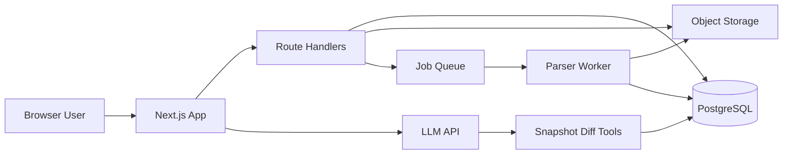

# Flux — Product Requirements Document

**Working name:** Flux  
**Tagline:** GitHub for Hardware  
**Elevator:** Version, review, and release electronics designs together — with AI that understands what actually changed on the board.  
**Document status:** Implementation-ready (Cursor build bible)  
**Stack:** Next.js (App Router) + TypeScript + React, browser-first  
**Primary CAD (MVP):** KiCad  
**Last updated:** 2026-08-05

---

## Table of contents

1. [Problem, vision, principles](#1-problem-vision-principles)
2. [Personas & jobs-to-be-done](#2-personas--jobs-to-be-done)
3. [Product pillars](#3-product-pillars)
4. [AI verdict & Flux Copilot](#4-ai-verdict--flux-copilot)
5. [Information architecture & UX](#5-information-architecture--ux)
6. [Screen inventory & App Router map](#6-screen-inventory--app-router-map)
7. [User journeys](#7-user-journeys)
8. [Functional requirements (MoSCoW)](#8-functional-requirements-moscow)
9. [Non-functional requirements](#9-non-functional-requirements)
10. [System architecture](#10-system-architecture)
11. [Data model](#11-data-model)
12. [API surface (MVP)](#12-api-surface-mvp)
13. [Phased roadmap](#13-phased-roadmap)
14. [Success metrics](#14-success-metrics)
15. [Risks & mitigations](#15-risks--mitigations)
16. [Cursor implementation brief](#16-cursor-implementation-brief)
17. [Out of scope (v1)](#17-out-of-scope-v1)
18. [Glossary](#18-glossary)

---

## 1. Problem, vision, principles

### 1.1 Problem

Hardware teams still collaborate like it is 2005:

- Designs live in Dropbox, email, Slack, and USB sticks.
- Reviews happen on PDFs and screenshots; reviewers cannot see *what actually changed* electrically.
- Git is used as a file dump. Binary or opaque CAD files yield useless diffs, broken merges, and no board-aware history.
- BOMs drift from schematics; manufacturing packages are hand-assembled folders with no checksum audit.
- New engineers cannot ask the design “what changed and why.”
- Companies lack GitHub-grade org primitives: permissions, review gates, CI, releases, libraries.

Competitors exist in niches (visual diff, PLM, BOM tools). None own the full **developer-platform experience** for electronics the way GitHub owns software.

### 1.2 Vision

Flux is the home for hardware teams the way GitHub is for software teams.

| Software analog | Flux equivalent |
|---|---|
| Git repository | Hardware project (schematic, PCB, libs, docs, pinouts) |
| Diff / blame | Visual schematic + PCB + BOM + 3D diffs |
| Pull request | Design Review (DR) |
| CI checks | Hardware Checks (ERC/DRC, BOM policy, DFM gate) |
| Releases | Manufacturing packages (Gerber, pick-place, BOM, fab notes) |
| Copilot | Flux Copilot (design-aware, evidence-linked) |
| Packages | Org-approved component / footprint libraries |
| Orgs / teams | Companies, projects, RBAC, audit trail |

**Diff is the wedge. Lifecycle collaboration is the product.**

### 1.3 Principles

1. **CAD remains the authoring truth.** Engineers draw in KiCad (later Altium, etc.). Flux does not replace the editor in v1.
2. **Flux owns collaboration.** History, review, permissions, CI, release, AI narrative.
3. **Structured identity over blob storage.** Parse into a normalized Design Context Graph; never pretend zip-of-binaries is version control.
4. **AI must cite evidence.** Every Copilot finding links to a net, component, sheet region, BOM line, or check run.
5. **Human-in-the-loop.** AI suggests; humans approve merges and releases.
6. **Private by default.** Hardware IP is sacred; security and audit are product features.
7. **Purpose-built UI.** Must feel like an instrument for boards — never a thin GitHub skin over file trees.

---

## 2. Personas & jobs-to-be-done

### 2.1 Hardware engineer (primary)

- Upload / push a revision and open a Design Review in under 5 minutes.
- See schematic + BOM delta without exporting PDFs.
- Ask Copilot: “Summarize risks in this change.”
- Respond to review comments on specific parts/nets.

### 2.2 Reviewer / tech lead

- Approve or request changes with electrical confidence.
- Require green Hardware Checks before merge.
- Scan AI findings sorted by severity, jump to evidence.

### 2.3 EE / hardware manager

- See project health: open DRs, failing checks, overdue releases.
- Enforce org part policy and required reviewers.
- Audit who approved what for which revision.

### 2.4 Firmware / mechanical partner

- Read pinout / connector / keepout notes attached to a revision.
- View 3D board outline (Phase 2+) without opening CAD.

### 2.5 Procurement / CM / manufacturing

- Consume versioned manufacturing packages with checksums.
- Diff BOMs across releases; see alternates and risk badges.

### Jobs-to-be-done (summary)

| Persona | Job |
|---|---|
| Engineer | “Ship a safe revision and get it reviewed fast.” |
| Lead | “Block bad changes before they reach fab.” |
| Manager | “Know what is shipping and who signed off.” |
| Procurement | “Trust this BOM and package for fab.” |
| New hire | “Understand this board without tribal knowledge.” |

---

## 3. Product pillars

### Pillar A — Projects & versioning

- Organizations, teams, projects, branches (`main` / feature), revisions (commits), tags.
- Upload KiCad project (zip or folder sync); store originals + derived artifacts.
- Derived artifacts: Design Snapshot JSON (nets, components, footprints), schematic render layers, BOM snapshot, later PCB geometry / 3D mesh.
- Branch model simplified for hardware: feature branches → Design Review → merge to `main`.
- Tags map to semantic or ECO versions (`v1.2.0`, `ECO-0041`).

### Pillar B — Visual intelligence

- Schematic: side-by-side and overlay modes; highlight added / removed / changed symbols and wires.
- PCB (Phase 2): copper / silk / mask layer diff; 3D board compare.
- BOM table diff: adds, removes, value / footprint / MPN changes.
- Identity tracking: refdes continuity and net rename heuristics across revisions.

### Pillar C — Design Reviews (PR analog)

- Create DR from branch or from revision range.
- Assignees, required reviewers, linked check runs.
- Comments anchored to part, net, sheet, or rectangular region.
- States: `draft` → `open` → `approved` / `changes_requested` → `merged` / `closed`.
- ECO / change-reason templates required on merge (configurable).

### Pillar D — Hardware CI

- Ingest ERC/DRC reports from KiCad headless / uploaded reports.
- BOM completeness, MPN validation, forbidden-parts policy.
- DFM gate before manufacturing release (Phase 3).
- Status surface on Design Review like GitHub checks.

### Pillar E — Libraries & BOM

- Org-approved parts library; footprint ownership.
- Per-project BOM graph derived from Design Snapshot.
- Alternates and lifecycle risk badges (Phase 3 enrichment APIs).

### Pillar F — Manufacturing releases

- Versioned Release object: Gerbers, drill, pick-place, BOM CSV, fab/assembly notes, SHA-256 checksums.
- Downloadable zip + audit log of who downloaded when.
- Immutable once published (supersede with new release, never silent overwrite).

### Pillar G — Flux Copilot (AI-first)

- Always-available rail on Design Review and revision compare views.
- Slash commands and structured findings (see §4).
- Does not claim electrical simulation correctness; frames findings as *review assistance*.

### Pillar H — Team OS

- Auth: email + Google/GitHub OAuth (SSO in Phase 4).
- RBAC: Owner, Admin, Engineer, Reviewer, Viewer, Procurement.
- Notifications, activity feed; webhooks in Phase 3.
- Audit log for regulated / OEM teams.

---

## 4. AI verdict & Flux Copilot

### 4.1 Is AI useful?

**Yes — as a first-class product surface**, not a chatbot bolted on later.

Hardware teams do not primarily need “autocomplete for traces.” They need an assistant that understands **design intent, electrical change, risk, and manufacturing impact**.

| Ship these | Do not claim in v1 |
|---|---|
| Plain-language change narratives | Fully automatic schematic/PCB layout |
| Reviewer agent with evidence links | Guaranteed electrical correctness |
| BOM intelligence & alternates | Replacing KiCad/Altium |
| Q&A over a revision / range | Silent auto-merge of designs |
| Release notes / ECO drafts | Simulation-grade SPICE |
| Onboarding: explain the board | |

### 4.2 Design Context Graph (required AI foundation)

```text
CAD files (KiCad)
    → Parsers (netlist, geometry, BOM)
        → Design Context Graph / Design Snapshot
            → Visual Diff Engine
            → Hardware CI Checks
            → Flux Copilot (RAG + tools)
                → Design Review UX
                    → Manufacturing Release
```

Copilot **never** answers from filenames alone. It answers from nets, components, footprints, constraints, and revision deltas.

### 4.3 Copilot UX

- Right rail on DR and Compare views; collapsible; keyboard `Ctrl+\`` or `Cmd+\``.
- Input: natural language + slash commands.
- Output: markdown + **Finding cards** (`severity`, `title`, `evidence[]`, `suggestedAction`).
- Clicking evidence pans/zooms the schematic/PCB/BOM table to the object.
- “Dismiss” / “Convert to comment” actions — human owns the thread.

### 4.4 Slash commands (MVP + roadmap)

| Command | Phase | Behavior |
|---|---|---|
| `/summarize` | 1 | Narrative of revision delta (schematic + BOM) |
| `/risks` | 1 | Severity-sorted findings with evidence |
| `/bom` | 1 | BOM delta summary + missing MPN flags |
| `/explain <refdes\|net>` | 1 | Local connectivity + nearby changes |
| `/compare <a>..<b>` | 1 | Same as UI compare, explained in prose |
| `/checklist` | 2 | Review checklist tailored to change types |
| `/release-notes` | 3 | Draft release notes from merged DRs |
| `/alternates <refdes>` | 3 | Second-source suggestions when enrichment available |

### 4.5 Finding schema (API / UI contract)

```ts
type FindingSeverity = "critical" | "high" | "medium" | "info";

interface CopilotFinding {
  id: string;
  severity: FindingSeverity;
  title: string;
  body: string;
  evidence: Array<{
    kind: "component" | "net" | "sheet_region" | "bom_line" | "check_run";
    ref: string;          // e.g. "U7", "VDD_3V3", "sheet:power"
    revisionId: string;
    deepLink: string;     // app route fragment
  }>;
  suggestedAction?: string;
  confidence: number;     // 0–1, shown subtly
}
```

### 4.6 Grounding rules (non-negotiable)

1. Prefer tool results from Design Snapshot / DiffBundle over model memory.
2. If evidence is missing, say “insufficient structured data” — do not invent nets.
3. Never auto-approve a Design Review.
4. Log prompts/responses for workspace admins with opt-out for enterprise later.
5. Customer CAD content is not used to train public models (product promise in privacy policy).

---

## 5. Information architecture & UX

### 5.1 Visual direction

**Look:** Minimal, high-contrast, lab-instrument meets developer tool.  
**Surfaces:** Charcoal / graphite base.  
**Accent:** Copper / amber signal (energized traces, CTA, selection).  
**Type:** Expressive, purposeful fonts — **not** Inter, Roboto, Arial, or system default stacks. Prefer a sharp geometric sans for UI + a technical mono for refdes/nets.  
**Avoid:** Purple-on-white / purple-indigo glow AI cliché; cream+terracotta magazine look; broadsheet newspaper density; emoji decoration; pill-clusters of stats in the first viewport.

**CSS tokens (required):**

```css
:root {
  --surface-0: #0c0d0f;
  --surface-1: #14161a;
  --surface-2: #1c1f26;
  --border: #2a2f3a;
  --text: #e8eaef;
  --text-muted: #8b93a7;
  --accent: #d4894a;       /* copper */
  --accent-2: #f0b429;     /* amber signal */
  --danger: #e85d4c;       /* DRC / critical */
  --warn: #e0a106;
  --success: #3dbe7b;      /* merge / checks green */
  --info: #5b8def;
  --diff-add: #1f6f4a;
  --diff-del: #8b2e2e;
  --diff-chg: #8a6a1f;
}
```

Light theme may ship later; dark is the primary craft surface for the app. Marketing may use a distinct but brand-aligned composition.

### 5.2 Marketing site (first viewport mandate)

Hero must read as **one composition**:

- Brand name **Flux** as hero-level signal (not nav-only).
- One headline.
- One short supporting sentence.
- One CTA group (`Start free` / `Book demo`).
- One dominant full-bleed visual: real board copper diff / schematic overlay atmosphere (not abstract purple gradients as the main idea).

No stats strips, schedule cards, or promo chips on the hero media.

### 5.3 App shell

```
Top bar: Flux mark · Org switcher · Search · Copilot · Notifications · Avatar
Left nav (project context): Overview · History · Files · Reviews · Checks · BOM · Library · Releases · Settings
Main canvas: context-dependent
Right rail: Copilot (contextual) or Review details
```

### 5.4 Signature interactions (ship intentional motion)

1. **Overlay morph** between baseline / proposed schematic or PCB layers (scrubber or hold-to-compare).
2. **Finding pulse** — Copilot finding highlight draws attention then settles on evidence object.
3. **Review status micro-transition** — open → approved → merged with restrained motion (no bounce spam).

Optional later: focus-net isolation dimming unrelated copper.

### 5.5 Density rules

- Review focus mode: maximize canvas; hide marketing chrome; optional zen layout.
- Lists (BOM, history): dense, tabular, keyboard navigable.
- Empty states: crazy-clean, one action, one sentence — no fake dashboard cards.

---

## 6. Screen inventory & App Router map

Use this as the Next.js route scaffold. Dynamic segments: `[org]`, `[project]`, `[reviewId]`, `[releaseId]`, `[revisionId]`.

### 6.1 Marketing (`(marketing)` route group)

| Route | Screen | Purpose |
|---|---|---|
| `/` | Landing | Brand-first hero + problem → pillars |
| `/pricing` | Pricing | Free / Team / Enterprise |
| `/docs` | Docs hub | Getting started, KiCad upload, Copilot |
| `/changelog` | Changelog | Product updates |
| `/legal/privacy` | Privacy | IP + AI data stance |
| `/legal/terms` | Terms | Terms of service |

### 6.2 Auth

| Route | Screen |
|---|---|
| `/sign-in` | Sign in |
| `/sign-up` | Sign up |
| `/invite/[token]` | Accept org invite |

### 6.3 App (`(app)` route group)

| Route | Screen | Phase |
|---|---|---|
| `/app` | Org / project picker redirect | 0 |
| `/app/[org]` | Org home — projects grid | 0 |
| `/app/[org]/settings` | Org settings, members, roles | 0–1 |
| `/app/[org]/library` | Org parts library | 2 |
| `/app/[org]/[project]` | Project overview — latest main, open DRs, checks | 0 |
| `/app/[org]/[project]/history` | Revision graph / timeline | 0 |
| `/app/[org]/[project]/files` | File browser for a revision | 0 |
| `/app/[org]/[project]/compare` | Compare two revisions (query: `base`, `head`) | 1 |
| `/app/[org]/[project]/reviews` | Design Review list | 1 |
| `/app/[org]/[project]/reviews/new` | Create Design Review | 1 |
| `/app/[org]/[project]/reviews/[reviewId]` | Design Review workspace (diff + checks + Copilot) | 1 |
| `/app/[org]/[project]/bom` | BOM for selected revision | 1 |
| `/app/[org]/[project]/checks` | Check runs history | 2 |
| `/app/[org]/[project]/releases` | Releases list | 3 |
| `/app/[org]/[project]/releases/new` | Create release | 3 |
| `/app/[org]/[project]/releases/[releaseId]` | Release detail + download | 3 |
| `/app/[org]/[project]/settings` | Project settings, branches, required checks | 1 |

### 6.4 Key UI regions on Design Review workspace

Must implement as composition, not card soup:

1. **Header:** title, branch range, status, merge/close actions.
2. **Tabs:** Schematic · PCB (P2) · BOM · Files · Checks · Conversation.
3. **Canvas:** visual diff viewer with overlay slider, layer toggles, fit/zoom, focus search (`refdes` / `net`).
4. **Thread:** anchored comments + general discussion.
5. **Copilot rail:** findings + chat.
6. **Checks strip:** pass/fail chips linking to check detail.

### 6.5 Component inventory (frontend packages)

`packages/ui` primitives: Button, Input, Select, Dialog, Dropdown, Tabs, Tooltip, Toast, Avatar, Badge, DataTable, EmptyState, KeyboardHint.

`apps/web` product components:

- `ProjectHeader`, `RevisionTimeline`, `FileTree`
- `SchematicDiffViewer`, `BomDiffTable`, `OverlayScrubber`
- `PcbLayerDiffViewer`, `Board3DCompare` (Phase 2)
- `DesignReviewHeader`, `CommentAnchor`, `CheckRunList`
- `CopilotRail`, `FindingCard`, `EvidenceLink`
- `ReleasePackageList`, `ChecksumPanel` (Phase 3)
- `OrgSwitcher`, `RoleGate`

---

## 7. User journeys

### Journey A — First project (Phase 0–1)

1. Sign up → create org → create project.
2. Upload KiCad project zip.
3. Worker parses → Design Snapshot ready.
4. User opens History, sees revision `r1`.
5. Uploads `r2` (or pushes via CLI later).
6. Opens Compare `r1`..`r2`, sees schematic + BOM diff.
7. Creates Design Review; invites reviewer.
8. Runs `/summarize` and `/risks` in Copilot.
9. Reviewer comments on `C12`; requester updates and uploads `r3`.
10. Checks green → Approve → Merge to `main`.

### Journey B — Lead gates a bad change

1. Engineer opens DR changing MPN of a TVS diode.
2. BOM policy check fails (not on approved list).
3. Copilot finding: high severity — footprint mismatch risk.
4. Lead requests changes; merge blocked.
5. Engineer fixes; checks pass; lead approves.

### Journey C — Release to fab (Phase 3)

1. From `main` @ tag `v1.3.0`, create Release.
2. Attach Gerbers / PnP / BOM / notes (or generate from artifacts).
3. Flux writes checksums; publish immutable release.
4. Procurement downloads package; audit records download.

### Journey D — New hire onboarding

1. Opens latest `main` revision.
2. Asks Copilot: “Explain the power tree and major ICs.”
3. Follows evidence links across schematic sheets.

---

## 8. Functional requirements (MoSCoW)

Acceptance criteria use Given/When/Then where critical.

### 8.1 Auth & orgs — Must (Phase 0)

| ID | Requirement | Acceptance |
|---|---|---|
| A1 | Email + OAuth sign-in | User can register and land in `/app` |
| A2 | Create organization | Org has unique slug; creator is Owner |
| A3 | Invite members by email | Invite link sets role; accepted user gains access |
| A4 | RBAC enforcement | Viewer cannot merge DR or change settings |

### 8.2 Projects & revisions — Must (Phase 0)

| ID | Requirement | Acceptance |
|---|---|---|
| P1 | Create project | Project belongs to org; private by default |
| P2 | Upload KiCad zip as revision | Files stored in object storage; revision listed in History |
| P3 | File browser | User browses project files for a selected revision |
| P4 | Branch `main` default | First upload creates `main` @ revision |

**AC — P2:** Given a valid KiCad project zip, when upload completes, then a Revision row exists, upload job reaches `succeeded` or `failed` with error message, and raw artifacts are downloadable by authorized users.

### 8.3 Design Snapshot & parse — Must (Phase 1)

| ID | Requirement | Acceptance |
|---|---|---|
| S1 | Parse KiCad schematic + netlist into Design Snapshot | Snapshot contains components[], nets[], sheets[] |
| S2 | Derive BOM snapshot | BomLine per refdes with value, footprint, MPN if present |
| S3 | Parse failure UX | UI shows actionable error; revision still stored as files |

### 8.4 Visual & BOM diff — Must (Phase 1)

| ID | Requirement | Acceptance |
|---|---|---|
| D1 | Schematic side-by-side + overlay | User toggles modes; changed items highlighted |
| D2 | BOM diff table | Adds/removes/changes filterable |
| D3 | Compare route | `/compare?base=&head=` loads DiffBundle |

**AC — D2:** Given two snapshots, when BOM values differ for same refdes, then row appears under Changed with old→new values.

### 8.5 Design Reviews — Must (Phase 1)

| ID | Requirement | Acceptance |
|---|---|---|
| R1 | Create DR from base..head | DR appears in list with `open` status |
| R2 | Comment on review (general) | Comment visible in Conversation |
| R3 | Approve / request changes / merge | State machine enforced; only permitted roles |
| R4 | Merge updates `main` pointer | `main` HEAD becomes head revision |

### 8.6 Flux Copilot — Must (Phase 1)

| ID | Requirement | Acceptance |
|---|---|---|
| C1 | Copilot rail on DR + Compare | Opens, accepts prompt, streams response |
| C2 | `/summarize`, `/risks`, `/bom`, `/explain` | Each returns grounded output or explicit insufficiency |
| C3 | Finding cards with deep links | Click navigates/highlights evidence |
| C4 | Convert finding → comment | Creates review comment prefilled |

### 8.7 Hardware CI — Should (Phase 2) / partial Could in Phase 1

| ID | Requirement | Phase |
|---|---|---|
| H1 | Upload / ingest ERC report JSON | 2 |
| H2 | BOM missing-MPN check auto on parse | 1 (basic) |
| H3 | Forbidden parts policy | 2 |
| H4 | Required checks block merge | 2 |

### 8.8 PCB visual — Should (Phase 2)

| ID | Requirement | Phase |
|---|---|---|
| B1 | Layer toggles + copper overlay diff | 2 |
| B2 | 3D board compare (R3F) | 2 |
| B3 | Comment anchors on sheet region | 2 |

### 8.9 Libraries — Should (Phase 2)

| ID | Requirement | Phase |
|---|---|---|
| L1 | Org library CRUD for approved MPNs | 2 |
| L2 | Flag BOM lines not in library | 2 |

### 8.10 Releases — Should (Phase 3)

| ID | Requirement | Phase |
|---|---|---|
| F1 | Create immutable Release with artifacts | 3 |
| F2 | Checksums displayed + verified on download page | 3 |
| F3 | Download audit log | 3 |

### 8.11 Team OS extras — Could

| ID | Requirement | Phase |
|---|---|---|
| T1 | Activity feed | 2 |
| T2 | Webhooks on DR/release events | 3 |
| T3 | SSO/SAML | 4 |
| T4 | CLI `flux push` | 3 |
| T5 | Altium import best-effort | 3 |

### 8.12 Won’t (v1 product)

- In-browser full schematic/PCB editor.
- Automatic autorouter / generative full-board layout.
- Guaranteeing electrical correctness without external tools.
- Public anonymous package registry (unless explicitly productized later).

---

## 9. Non-functional requirements

### 9.1 Security

- Private projects by default; no public listing without explicit opt-in.
- Encryption at rest (managed DB + object storage).
- Signed URLs for artifact download; short TTL.
- Tenant isolation: all queries scoped by `orgId`.
- RBAC on every mutating API.
- Secrets never in client bundles.
- Audit log for: invites, role changes, merges, releases, downloads.

### 9.2 Performance targets

| Scenario | Target |
|---|---|
| Project overview TTFB (warm) | < 400 ms server |
| DiffBundle ready for mid-size KiCad project (~500 components) | < 60 s after upload parse |
| Schematic canvas pan/zoom | 60 fps on modern laptop |
| Copilot first token | < 3 s after context assembled |
| BOM table 5k rows | Virtualized; interactive filter < 100 ms |

### 9.3 Reliability

- Parse/upload jobs idempotent and retryable.
- Failed jobs surface error codes to UI.
- Releases immutable; storage versioned.

### 9.4 Observability

- Structured logs with `requestId`, `orgId`, `projectId`.
- Metrics: parse success rate, DR merge time, Copilot finding accept rate.
- Error tracking (e.g. Sentry).

### 9.5 Accessibility

- Keyboard paths for review actions and Copilot.
- Contrast meeting WCAG AA for text on surfaces.
- Focus visible; do not rely on color alone for diff (icons/labels too).

### 9.6 Compliance posture (messaging)

- Publish DPA pathway for enterprise.
- Clear “we do not train public models on your designs” statement.
- Data residency as enterprise Phase 4 option.

---

## 10. System architecture

### 10.1 Monorepo layout

```text
/
├── apps/
│   └── web/                 # Next.js App Router
├── packages/
│   ├── ui/                  # Design system
│   ├── design-core/         # Diff, snapshot types, pure logic
│   ├── db/                  # Prisma/Drizzle schema + client
│   └── config/              # ESLint, TSConfig, Tailwind presets
├── workers/
│   └── parser/              # KiCad → Design Snapshot jobs
├── PRD.md
└── README.md
```

### 10.2 Locked stack

| Layer | Choice |
|---|---|
| Frontend | Next.js App Router, TypeScript, Tailwind, Framer Motion |
| 3D | React Three Fiber + Drei (Phase 2) |
| API | Next.js route handlers |
| Jobs | Inngest **or** BullMQ + Redis (pick one at scaffold; default **Inngest** for speed) |
| DB | PostgreSQL (Neon or Supabase) |
| ORM | Drizzle (preferred) or Prisma |
| Object storage | S3-compatible (R2 / S3 / Supabase Storage) |
| Auth | Clerk **or** Auth.js (default **Clerk** for MVP speed) |
| AI | LLM API (OpenAI / Anthropic) + tool calling over Design Snapshot / DiffBundle |
| Parser | Python or Node worker reading KiCad S-expression / netlist exports |
| Hosting | Vercel (web) + worker hosting suitable for CPU parse jobs |

### 10.3 High-level flow



### 10.4 Normalize model (design-core)

`design-core` owns:

- TypeScript types for `DesignSnapshot`, `DiffBundle`, `BomLine`.
- Pure functions: `diffSnapshots(a, b)`, refdes match heuristics, severity ranking helpers.
- No React, no DB.

Parser worker produces JSON matching `DesignSnapshot` schema; web never re-parses large CAD on the request path for diffs.

### 10.5 KiCad MVP ingest

Accepted upload:

- `.zip` containing KiCad 6/7/8 project (`.kicad_pro`, `.kicad_sch`, `.kicad_pcb`, libs as present).

Pipeline:

1. Store zip + extracted files.
2. Generate netlist / use schematic parse → components + nets.
3. Optional: render schematic pages to SVG/PNG for viewer.
4. Persist Design Snapshot + BOM.
5. On compare: build DiffBundle; cache by `(baseRevisionId, headRevisionId)`.

---

## 11. Data model

### 11.1 Entities

```text
Organization
  id, name, slug, createdAt

User
  id, email, name, avatarUrl, createdAt

Membership
  id, orgId, userId, role  # owner|admin|engineer|reviewer|viewer|procurement

Project
  id, orgId, name, slug, description, visibility, defaultBranch, createdAt

Branch
  id, projectId, name, headRevisionId

Revision
  id, projectId, branchId?, parentRevisionId?, message, authorId, createdAt, parseStatus

Artifact
  id, revisionId, kind, path, storageKey, sha256, sizeBytes
  # kind: source|render|netlist|snapshot|report|gerber|other

DesignSnapshot
  id, revisionId, schemaVersion, dataJson  # components, nets, sheets, meta

BomLine
  id, revisionId, refdes, value, footprint, mpn, manufacturer, qty, attrsJson

DiffBundle
  id, projectId, baseRevisionId, headRevisionId, dataJson, createdAt

DesignReview
  id, projectId, number, title, body, baseRevisionId, headRevisionId,
  state, authorId, createdAt, mergedAt

ReviewAssignee
  reviewId, userId

Comment
  id, reviewId, authorId, body, parentId?,
  anchorKind?, anchorRef?, anchorMetaJson?, createdAt

CheckRun
  id, projectId, revisionId, reviewId?, name, status, summary, detailsJson, createdAt

LibraryPart
  id, orgId, mpn, manufacturer, footprint, status, notes, createdAt

Release
  id, projectId, tag, title, revisionId, notes, createdBy, createdAt, immutable true

ReleaseArtifact
  id, releaseId, path, storageKey, sha256, sizeBytes

CopilotThread
  id, userId, projectId, reviewId?, revisionBaseId?, revisionHeadId?, createdAt

CopilotMessage
  id, threadId, role, content, findingsJson?, createdAt

Finding
  id, reviewId?, threadId?, messageId?, severity, title, body, evidenceJson, status
  # status: open|dismissed|converted

AuditEvent
  id, orgId, actorId, action, targetType, targetId, metaJson, createdAt
```

### 11.2 DesignSnapshot JSON (conceptual)

```json
{
  "schemaVersion": 1,
  "tool": { "name": "kicad", "version": "8.x" },
  "sheets": [{ "id": "root", "name": "Root", "title": "Main" }],
  "components": [
    {
      "refdes": "U7",
      "value": "STM32G431",
      "footprint": "Package_QFP:LQFP-48",
      "mpn": "STM32G431CBU6",
      "sheetId": "root",
      "pins": [{ "number": "1", "name": "VBAT", "net": "VDD" }]
    }
  ],
  "nets": [
    { "name": "VDD", "class": "power", "nodes": ["U7.1", "C12.1"] }
  ],
  "meta": { "sheetCount": 1, "componentCount": 128 }
}
```

---

## 12. API surface (MVP)

All under `/api`, authenticated, org-scoped.

### Auth / session

Handled by Clerk/Auth.js middleware.

### Orgs & projects

- `POST /api/orgs`
- `GET /api/orgs/[org]`
- `POST /api/orgs/[org]/invites`
- `POST /api/orgs/[org]/projects`
- `GET /api/orgs/[org]/projects/[project]`

### Revisions

- `POST /api/orgs/[org]/projects/[project]/revisions` (multipart upload)
- `GET /api/orgs/[org]/projects/[project]/revisions`
- `GET /api/orgs/[org]/projects/[project]/revisions/[revisionId]`
- `GET .../revisions/[revisionId]/artifacts`

### Diff

- `GET .../compare?base=&head=` → DiffBundle (compute/cache)

### Reviews

- `GET|POST .../reviews`
- `GET|PATCH .../reviews/[reviewId]`
- `POST .../reviews/[reviewId]/comments`
- `POST .../reviews/[reviewId]/approve`
- `POST .../reviews/[reviewId]/request-changes`
- `POST .../reviews/[reviewId]/merge`

### Copilot

- `POST .../copilot/chat`  
  Body: `{ projectId, reviewId?, baseRevisionId, headRevisionId, messages[], command? }`  
  Response: SSE stream of tokens + final `findings[]`.

### Checks (Phase 1 basic / Phase 2 full)

- `GET .../checks?revisionId=`
- `POST .../checks/run` (internal/worker)

---

## 13. Phased roadmap

### Phase 0 — Foundation (weeks 1–3)

- Monorepo scaffold, UI tokens, auth, orgs, projects.
- KiCad zip upload, revision history, file browser.
- Marketing landing (brand-first) + app shell.

**Exit criteria:** User can create org/project, upload KiCad, browse files/history.

### Phase 1 — AI-aware MVP (weeks 4–8) — shippable wow

- Parser → Design Snapshot + BOM.
- Schematic visual diff + BOM diff.
- Design Review workflow (create, comment, approve, merge).
- Copilot: `/summarize`, `/risks`, `/bom`, `/explain` with evidence links.
- Basic missing-MPN check.

**Exit criteria:** Two engineers can review a real KiCad change with AI summary and merge to `main`.

### Phase 2 — PCB & checks (weeks 9–14)

- PCB layer + 3D diff.
- Region/part/net comment anchors.
- ERC/DRC ingest + BOM policy checks; required checks gate merge.
- Org component library v1.
- Activity feed.

**Exit criteria:** Merge can be blocked by policy/ERC; PCB diff usable on mid-size board.

### Phase 3 — Manufacturing & company (weeks 15–22)

- Releases + checksum packages + download audit.
- Permissions polish, webhooks.
- Parts enrichment / alternates.
- Altium import best-effort.
- Optional CLI `flux push`.

**Exit criteria:** Team can cut an immutable fab release from approved `main`.

### Phase 4 — Scale

- SSO/SAML, advanced DFM partner integrations, firmware pinout sync, data residency, public/community features as warranted.

**Implementation status (local platform):** Demo SSO ACS + org SAML settings, DFM partner jobs (JLCPCB/PCBWay/Eurocircuits heuristics), firmware pinout sync + `.h` export, org data-residency regions with storage prefixes, public explore/star/fork. Production IdP crypto, live fab APIs, and multi-cloud residency are integration next steps.

**Electrical core status:** TypeScript KiCad connectivity resolve (wires/junctions/labels + pin heuristics, inspired by [parser_new](https://github.com/mananvyas2003/parser_new) / [NetDiff](https://github.com/mananvyas2003/NetDiff) engine), NetDiff-style semantic electrical diff in `@flux/design-core`, Compare electrical tab, Copilot `/nets`, and `connectivity-gate` check runs. Optional later: call native NetDiff CLI/WASM for oracle parity with `kicad-cli`.

---

## 14. Success metrics

| Metric | Definition | Phase 1 target |
|---|---|---|
| Time-to-first meaningful review | Signup → first DR opened with snapshot | < 30 minutes |
| Weekly active engineers / org | Users who open project or DR weekly | Growing MoM |
| AI finding action rate | Findings dismissed vs converted/commented | Track; iterate prompts |
| Parse success rate | Successful snapshots / uploads | > 90% KiCad 7/8 |
| Cycle time | DR open → merge | Qualitative improvement vs PDF review |
| Release package adoption (P3) | Releases created / active projects | > 50% active projects |

North-star qualitative: “We would not send a board to fab without a Flux review.”

---

## 15. Risks & mitigations

| Risk | Mitigation |
|---|---|
| CAD format fragility | KiCad-first; normalized DesignSnapshot; versioned schema |
| AI hallucination | Evidence-linked findings only; refuse when ungrounded |
| IP leakage fears | Private default; clear AI data policy; enterprise controls |
| “Yet another Git” perception | Board-native UI from day one; visual diff hero |
| Parse performance | Async workers; cache DiffBundles; progressive renders |
| Scope creep into CAD editing | Explicit out-of-scope; partner with existing CAD tools |
| Multi-CAD demand early | Roadmap Altium; do not block KiCad MVP excellence |

---

## 16. Cursor implementation brief

### 16.1 Build order for agents

1. Scaffold monorepo (`apps/web`, `packages/ui`, `packages/design-core`, `packages/db`, `workers/parser`).
2. Implement design tokens + root layout + marketing landing (§5).
3. Auth + org/project CRUD + RBAC middleware.
4. Upload → storage → revision list → file browser.
5. Parser worker → DesignSnapshot + BomLine.
6. `diffSnapshots` + Compare UI (schematic + BOM).
7. Design Review state machine + comments.
8. Copilot SSE + tools over DiffBundle.
9. Polish empty states, keyboard shortcuts, motion (§5.4).

### 16.2 Definition of done — Phase 1 MVP

- [ ] New user can complete Journey A on a sample KiCad project.
- [ ] Schematic overlay + BOM diff work for non-trivial delta.
- [ ] Design Review can be approved and merged.
- [ ] Copilot `/summarize` and `/risks` return evidence-linked findings or honest insufficiency.
- [ ] UI matches visual direction (copper/charcoal, no purple-glow cliché).
- [ ] README documents env vars and local run.
- [ ] Critical paths typed; no secrets committed.

### 16.3 Sample seed data

Ship `fixtures/kicad/blinky/` (or similar) with two revisions for demo compare.

### 16.4 Env vars (indicative)

```text
DATABASE_URL=
S3_ENDPOINT=
S3_BUCKET=
S3_ACCESS_KEY=
S3_SECRET_KEY=
CLERK_SECRET_KEY=
NEXT_PUBLIC_CLERK_PUBLISHABLE_KEY=
LLM_API_KEY=
LLM_MODEL=
INNGEST_EVENT_KEY=
INNGEST_SIGNING_KEY=
```

### 16.5 Testing expectations

- Unit: `diffSnapshots`, RBAC helpers.
- Integration: upload → parse → compare API.
- E2E (Playwright): Journey A happy path.
- Copilot: fixture DiffBundle → assert findings include evidence refs (mock LLM optional).

---

## 17. Out of scope (v1)

- Full in-browser CAD editor (schematic/PCB drawing).
- Multi-CAD parity beyond KiCad MVP (+ best-effort Altium only in Phase 3).
- Generative auto-layout / autorouter AI.
- SPICE / SI / PI simulation suites.
- Native desktop CAD plugins (beyond optional CLI later).
- Marketplace / public open-hardware social network (revisit later).
- Real-time multiplayer cursors on the canvas (nice-to-have post-MVP).

---

## 18. Glossary

| Term | Meaning |
|---|---|
| Design Snapshot | Normalized JSON model of a revision’s electrical/structural content |
| DiffBundle | Cached structured delta between two snapshots |
| Design Review (DR) | Pull-request analog for hardware changes |
| Hardware Check | CI-style gate (ERC/DRC/BOM/policy) |
| Release | Immutable manufacturing package tied to a revision |
| Flux Copilot | Design-aware AI assistant with evidence-linked findings |
| Refdes | Reference designator (e.g. `R12`, `U3`) |
| MPN | Manufacturer part number |
| ECO | Engineering change order |

---

## Appendix A — RBAC matrix (MVP)

| Action | Owner | Admin | Engineer | Reviewer | Viewer | Procurement |
|---|---|---|---|---|---|---|
| Manage billing / delete org | ✓ | | | | | |
| Invite / roles | ✓ | ✓ | | | | |
| Create project | ✓ | ✓ | ✓ | | | |
| Upload revision | ✓ | ✓ | ✓ | | | |
| Open DR | ✓ | ✓ | ✓ | ✓ | | |
| Comment | ✓ | ✓ | ✓ | ✓ | | |
| Approve DR | ✓ | ✓ | | ✓ | | |
| Merge DR | ✓ | ✓ | ✓* | | | |
| Publish release | ✓ | ✓ | ✓ | | | ✓ (download) |
| Download release | ✓ | ✓ | ✓ | ✓ | ✓ | ✓ |
| View source / diff | ✓ | ✓ | ✓ | ✓ | ✓ | BOM/release focused |

\*Merge may require approval + green checks when configured.

---

## Appendix B — Copy deck (product voice)

- Voice: precise, calm, engineer-to-engineer. No hype fluff.
- Prefer “revision,” “Design Review,” “release” over vague “sync” / “workspace magic.”
- Copilot speaks as a reviewer assistant: provisional, evidence-based, respectful of EE judgment.

**Example landing headline options (pick one at build):**

1. `GitHub for Hardware`
2. `Review boards like you review code`
3. `Every change. On the copper. Explained.`

Supporting: `Version, review, and release electronics with AI that understands your schematic — not just your filenames.`

CTA: `Start free` · secondary `See a live diff`

---

*End of PRD. Implement Phase 0 → Phase 1 unless directed otherwise. This document is the source of truth for scope arguments.*
